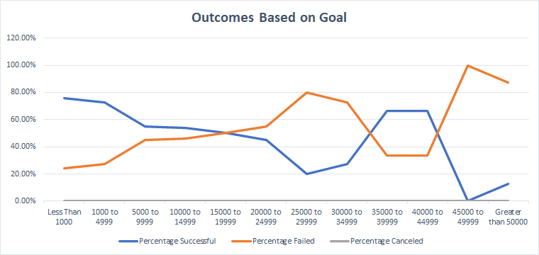

# Written Analysis of Kick Starter Campaigns
## This is an analysis of multiple kick starter campaigns from different countries. This analysis was focused to on a comparison of the success of the plays in our list of kick starters. 
---
### Outcomes vs Launch
---
The first analysis was focused on the theater category to highlight what months were ideal for launch. This data showed that the ideal months to launch theater-based projects are between May and July. The other outcomes had little variations throughout the year, so the success of the theatre kick starters is dependent on something other than just the launch date. 

---
### Outcomes vs Goals
---
The next analysis was to identify how the goal amount can factor into the success of a project. Those plays that had goals below 20,000 had a 50 percent chance of success. Goals lower than 5,000 had a much significant higher chance of being successful by about 20%. This may help future kick starters focus aim for a budget below 5,000. There is a unique group of plays that had a succeeded beyond 60% with goals between 35,000 to 44,000. A more extensive analysis may be required to understand their success.  

---
#### Challenges and limitations:
The data had to be broken down further to get a more detailed view of the important factors needed to analyze the success and failures of these kick starters. In addition, this data is limited to provide all the possible reasons for the success and failure of the projects. In the "Outcomes vs Launch" analysis, a deeper dive may be needed to understand how the goals and pledges data compares to the months of May, June, and July to understand why those months were so successful. In the "Outcome vs Goal," we found some outliers that showed a remarkable level of success. A measure of "popularity" or "Play subject/type" could be added to see if there is a pattern that could express why some goals between 35,000 to 44,000 had as much success as those less than 5,000.
